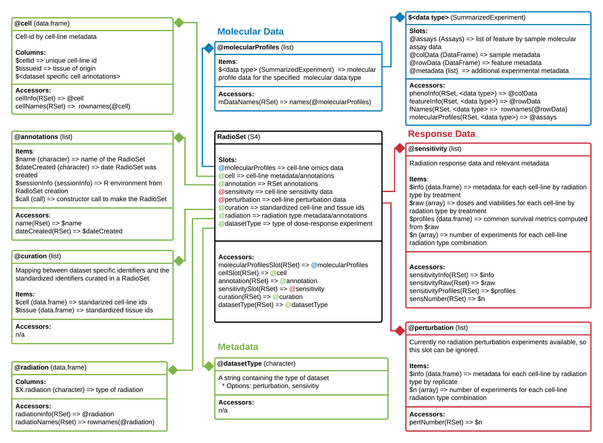

```{r setup, include=FALSE}
knitr::opts_chunk$set(echo = TRUE)
```

# Introduction

The RadioGx package implements a standardized data structure for storing highly
curated results from Radiogenomic experiments. Such experiments investigate the
relationship between different cancer cell lines and their response to various
doses and types of ionizing radiation. The package is intended for use in 
conjunction with the PharmacoGx package which provides a similar data structure
and API for storing highly curated Pharmacogenomic experiments.

On top of the S4 RadioSet class, this package also provides a standard API 
to access functions related to fitting dose response curves, calculating survival
fraction and fitting linear-quadratic models. Additional functions for calculating
the correlation between radiation dose and radiation response allow
for characterization of the radiation sensitivity of myriad cancer cell lines
representing a diverse set of cancer phenotypes.

It is our hope that this package can aid clinicians and fellow researchers in
treatment planning and radiation sensitivity discovery in existing cancer types
as well as prospectively in new **in vitro** and **in vivo** models of cancer.

# Creating a RadioSet

Documentation for creating a RadioSet object will be added to this package 
in the coming months. In the mean time consult the 'Creating A PharmacoSet' 
vignette from the PharmacoGx Bioconductor package for an example of creating
a related data structure.

# Basic Functionalities of RadioGx

## Installing RadioGx

To install the `r BiocStyle::Biocpkg('RadioGx')` package, run:

```{r install_radiogx, eval=FALSE, message=FALSE}
BiocManager::install('RadioGx', version='devel')
```

```{r load_package, message=FALSE}
library(RadioGx)
```

## RadioSet

The RadioSet has a structure similar to the `PharmacoSet` and also inherits
from the CoreSet^[exported by `r BiocStyle::Biocpkg('CoreGx')`] class . The radiation
slot is implemented in `r BiocStyle::Biocpkg('RadioGx')`  to hold relevant metadata
about the type(s) of radiation used in the dose-response experiment,
and is analogous to the drug slot in a `PharmacoSet`. The remainder of the slots
mirror the `PharmacoSet`.

```{r radioset, echo=FALSE, fig.wide=TRUE, fig.cap = "**RadioSet class diagram**. Objects comprising a `RadioSet` are enclosed in boxes. First box indicates type and name of each object. Second box indicates the structure of an object or class. Third box shows accessor methods from `RadioGx` for that specific object. '=>' represents return and specifies what is returned from that item or method."}

```

## Downloading an RSet

`r BiocStyle::Biocpkg('RadioGx')` provides an interface similar to `r BiocStyle::Biocpkg("PharmacoGx")`
and `r BiocStyle::Biocpkg('Xeva')` for downloading our curated versions of published datasets.

To get a list of available `RadioSet`s, use:

```{r available_rsets, evel=FALSE, message=FALSE}
RSets <- availableRSets()
```

As the `r BiocStyle::Biocpkg('RadioGx')` package was only recently released, there is
currently only one dataset available. Let's download the 'Cleveland' RSet, which contains
a highly curated version of the data from Yang *et al.*, 2016.

```{r download_rset, eval=FALSE}
Cleveland <- downloadRSet('Cleveland', saveDir='.')
```

```{r printing_a_radioset, hide=TRUE}
data(clevelandSmall)
clevelandSmall
```

Similar to PharmacoGx and Xeva, a summary of the contents of the RadioSet is printed
when calling a RadioSet in the console. We can see that the clevelandSmall RSet contains
sensitivity information for 5 cell-lines treated with a single type of radiation.
The RSet also contains rna^[microarray], rna-seq and cnv molecular data for a subset of available
cell-lines.

## Accessing Data

RadioGx stores three major categories of data: metadata/annotations, molecular data and radiation response data.
These are demarcated in **Fig.** \@ref(fig:radioset) using green, blue and red, respectively. Accessor methods are available
to retrieve all three kinds of data from an RSet; the accessor methods for each component are listed
in the bottom most cell of each object in the RadioGx class diagram. We will discuss a subset of these methods
now.

### Accessing metadata

Metadata in an RSet is stored in the same slots as in a `PharmacoSet`, and can be accessed using the same
generic accessor functions as in `r BiocStyle::Biocpkg('PharmacoGx')`. A unique slot, `radiation` has additional
accessor methods to retrieve the radiation types used in a given sensitivity experiment.

```{r radiation_info_accessor}
# Get the radiation info data.frame from an RSet
radInf <- radiationInfo(clevelandSmall)
```

```{r print_radinf, fig.wide = TRUE}
knitr::kable(radInf)
```

Currently, only one type of radiation has been used in an `RSet`. However, we hope to add new `RSet`s covering a wider range of radiation
sensitivity and perturbation experiments in the near future. The following method is also available to retrieve the radiation
types as a `character` vector instead of a `data.frame`.

```{r radiation_types_accessor}
radTypes <- radiationTypes(clevelandSmall)
radTypes
```
### Accessing molecular data

Molecular data in an `RSet` is contained in the `molecularProfiles` slot and can be accessed the same way it is for a `PSet`.

```{r molecular_data_slot_accessors}
# Get the list (equivalent to @molecularProfiles, except that it is robust to changes in RSet structure
str(molecularProfilesSlot(clevelandSmall), max.level=2)

# Get the names from the list
mDataNames(clevelandSmall)
```

All molecular data in an RSet (any class inheriting from CoreSet, actually) is contained in a `SummarizedExperiment`
object. While `r BiocStyle::Biocpkg('SummarizedExperiment')` comes with it's own set of accessors, we recommend using
available `r BiocStyle::Biocpkg('RadioGx')` accessor methods as it allows your scripts to be robust to future changes
in the structure of a `RadioSet` object.

```{r sample_meta_data}
# Get sample metadata
phenoInf <- phenoInfo(clevelandSmall, 'cnv')
```

To keep the document formatted nicely, the following tables have been subset to the first three rows and columns.

```{r print_sample_meta_data, echo=FALSE, fig.small=TRUE}
knitr::kable(phenoInf[, 1:5], row.names=FALSE)
```

```{r feature_meta_data}
# Get feature metadata
featInfo <- featureInfo(clevelandSmall, 'rna')
```

```{r print_feature_meta_data, echo=FALSE, align="center"}
knitr::kable(featInfo[1:3, 1:5], row.names=FALSE)
```

```{r molecular_data, fig.wide=TRUE}
# Access the moleclar feature data
mProf <- molecularProfiles(clevelandSmall, 'rnaseq')
```

```{r print_molecular_profile_data, echo=FALSE}
knitr::kable(mProf[1:3, 1:5])
```

### Accessing response data

Data from radiation sensitivity and/or perturbation experiments is also retrieved the same way it is for a PSet. Currently,
only sensitivity experiments have been included in a `RadioSet`.

```{r response_data_accessors}
# Get sensitivity slot
sens <- sensitivitySlot(clevelandSmall)
```

```{r }
# Get sensitivity raw data
sensRaw <- sensitivityRaw(clevelandSmall)
```

```{r }
# Get sensitivity profiles
sensProf <- sensitivityProfiles(clevelandSmall)
```

```{r }
# Get sensitivity info
sensInfo <- sensitivityInfo(clevelandSmall)
```

## Fitting Linear Quadratic (LQ) Models

RadioGx provides a number of functions for analyzing dose response experiments.
To use these functions, we must first fit a statistical model to the dose
response data. This package exports a function for fitting linear-quadratic
models to dose response data. The function can be used with data contained in
a RadioSet or with raw dose-response data.

```{r model_fit}
# Extract raw sensitvity data from the RadioSet
sensRaw <- sensitivityRaw(clevelandSmall)
```

```{r structure_sensitivity_raw}
str(sensRaw)
```

The data returned by `sensitivityRaw(RSet)` is a three dimensional
array, but it can also be thought of as a set of experiment by treatment
matrices. We can see by the `dimnames` of the third dimensions that
the first matrix holds the radiation dose (in Gy) for each experiment,
while the second matrix holds the viability measurements for the cell-line
after each dose in the experimental series.

```{r cellline_names}
# Find a cancer cell-line of interest
head(sensitivityInfo(clevelandSmall)$cellid)
```

```{r selecting_cancer_cell_line}
cancerCellLine <- sensitivityInfo(clevelandSmall)$cellid[1]
print(cancerCellLine)
```

```{r extracting_dose_response_data}
# Get the radiation doses and associated survival data from clevelandSmall
radiationDoses <- sensRaw[1, , 'Dose']
survivalFractions <- sensRaw[1, , 'Viability']
```

```{r fitting_lq_model}
LQmodel <- linearQuadraticModel(D=radiationDoses,
                                SF=survivalFractions)
LQmodel
```

Above we see that LQmodel contains the alpha and beta coefficients for the dose
response curve fit to the dose and viability data for the IMR-32 cancer cell-line.
Based on the $R^2$ attribute we can see that the model fit for this data is
good, with `r round(attributes(LQmodel)$Rsquare,3 ) * 100`% of observed variance
explained by the model.

## Calculating Dose-Response Metrics

RadioGx provides a number of functions for calculating common dose response
metrics such as surviving fraction (SF), area under the curve (AUC) and dose at
which only 10% of cancer cells survive (D10).

Some of these functions require the alpha and beta coefficients, as calculated
above using the `linearQuadraticModel` function.

```{r metrics_computed_from_fit_parameters}
survFracAfter2Units <- computeSF2(pars=LQmodel)
print(survFracAfter2Units)

dose10PercentSurv <- computeD10(pars=LQmodel)
print(dose10PercentSurv)
```
We see from the above code cell that after two units of radiation,
`r round(100 * survFracAfter2Units, 3)`% of cancer cells remain relative to the initial population.
Conversely, using `computeD10` we see that on average `r round(dose10PercentSurv, 3)` units of radiation
need to be administered to result in 10% cell-line survival (i.e., 90% of cancer cells
are killed).

Other dose-response metrics can be computed directly using radiation dose
and cancer cell viability data.

```{r metrics_computed_from_dose_response_data}
areaUnderDoseRespCurve <- RadioGx::computeAUC(D=radiationDoses, pars=LQmodel, lower=0,
                                     upper=1)
print(areaUnderDoseRespCurve)
```

In the above code block we compute the AUC for a dose-response curve between a
dose of 0 to 1 Gy. This area can be interpreted as the total proportion of cells
killed during the administration of 1 Gy of radiation.

### Dose-Response Curves

The `doseResponseCurve` function can be used to generate plots of surviving
fraction vs dose for radiation sensitivity experiments. In this example
we provide raw data values to create the plot. When the `plot.type` is set to
"Both", a linear-quadratic model will also be fit to the supplied dose-response
values.

```{r plotting_rad_dose_resp, fig.small=TRUE}
doseResponseCurve(
  Ds=list("Experiment 1" = c(0, 2, 4, 6)),
  SFs=list("Experiment 1" = c(1,.6,.4,.2)),
  plot.type="Both"
)
```

Additionally, `doseResponseCurve` can be used to create dose response curves
directly from a curated RadioSet object. When utilizing this feature, a
cell-line must be selected from the RadioSet. This can be done by name
if you know which cell-line you are looking for. If you don't know which
cell-line you want to visualize, the available
cell-lines can be explored using the `cellInfo` function.

```{r plotting_rad_dose_resp_rSet, fig.small=TRUE}
doseResponseCurve(
  rSets=list(clevelandSmall),
  cellline=cellInfo(clevelandSmall)$cellid[5]
)
```

### Summarizing Sensitivity

To retrieve a radiation type by cell-line summary of a sensitivity experiment, we use the `summarizeSensitivityProfiles` function.
This will return a `matrix` where rows are radiation type^[Note there is currently only one radiation type available, but in the future there will be more], columns are cell-line and values are viability measurements summarized
using `summary.stat`^[Available options are 'mean', 'median', 'first', 'last']. The sensitivity measure to summarize can be
specified using `sensitivity.measure`^[See `sensitivityMeasures(RSet)` for available options].

```{r summarize_sensitivity}
sensSummary <- summarizeSensitivityProfiles(clevelandSmall)
```

```{r show_summarized_sensivitiy}
sensSummary[, 1:3]
```

### Summarizing Molecular Data

```{r summarize_molecular_data}
mprofSummary <- summarizeMolecularProfiles(clevelandSmall, mDataType='rna', summary.stat='median', fill.missing=FALSE)
```

```{r show_summarized_sensitivity}
mprofSummary
```

Due to a lack of replicates in the clevelandSmall `RSet`, the returned `SummarizedExperiment` object contains the same information as
the original. For other experiments with replicates, however, the result should contain one column per unique cell-line id. For
ease of interoperability with the response data contained in an `RSet`, if `fill.missing` is `r FALSE` empty columns for the
cell-lines in the sensitivity experiment, but not in the molecular profile will be added to the `SummarizedExperiment` such
that the dimensions are equal.

### Molecular Signatures for Biomarker Discovery

The true usefulness of the `RadioGx` packages comes from the ability to determine gene signatures for a
cell-lines from a sensitivity experiment. Cell-lines of interest to a given researcher can be selected
and a molecular signature computed which correlates specific molecular features with a given sensitivity profile.
Using this method one could identify signatures associated with either radio-sensitivity or radio-resistance.
Combining this signature with drug response gene signatures from `r BiocStyle::Biocpkg('PharmacoGx')`, as will
be done in the subsequent section, one can identify drugs which could augment the effectiveness of a
given radiation signature. Perhaps more powerfully, drugs which target features associated with radio-resistance
can be found, potentially synergistically increasing the overall effectiveness of the combined treatment.

```{r compute_molecular_signature}
radSensSig <- radSensitivitySig(clevelandSmall, mDataType='rna', features=fNames(clevelandSmall, 'rna')[2:5], nthread=1)
```

```{r exploring_molecular_signature}
radSensSig@.Data
```
